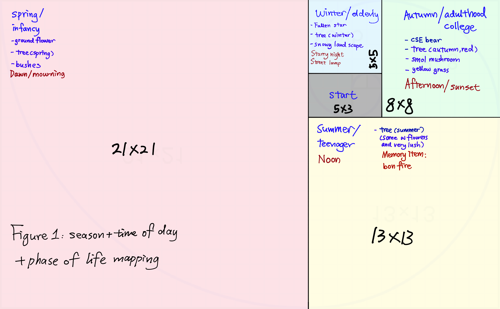
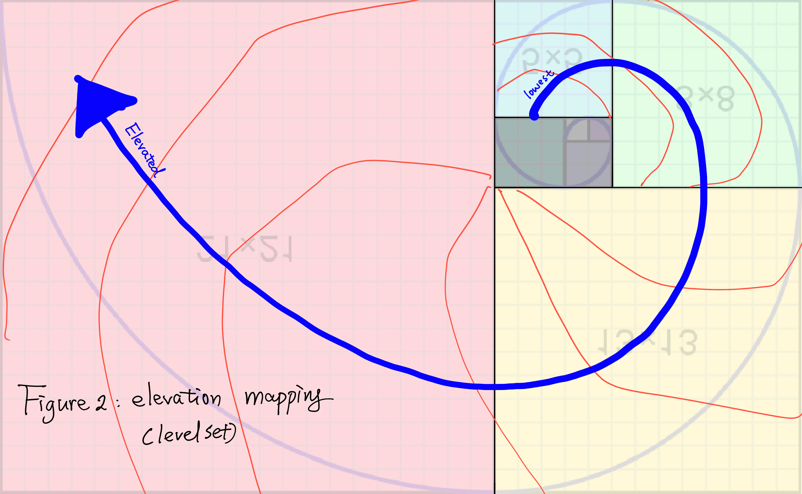
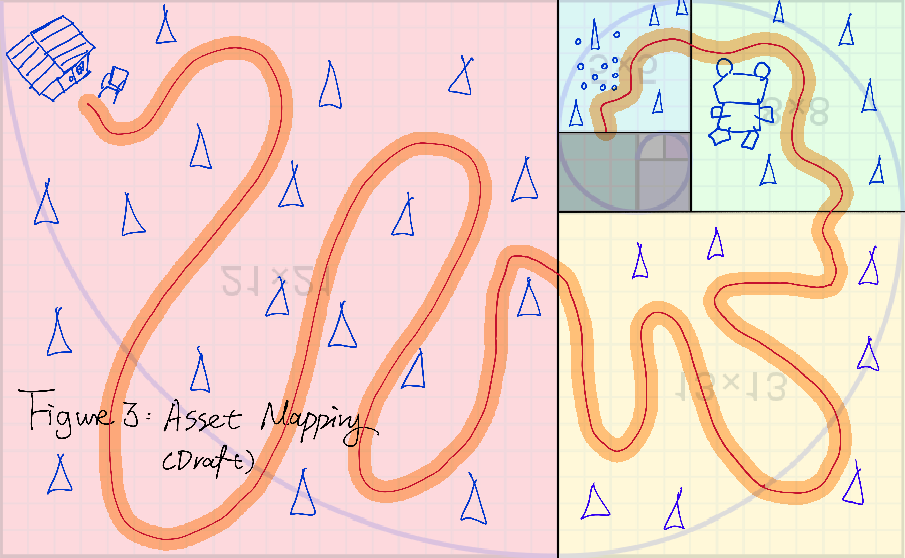
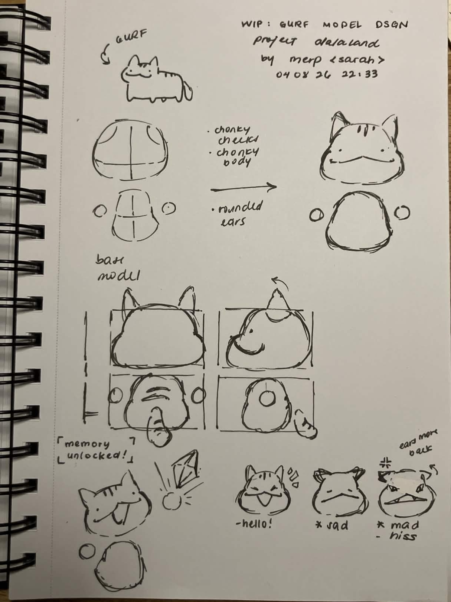
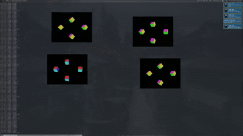
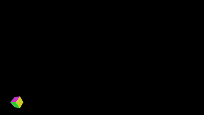

<!-- # [Weekly individual report template](https://docs.google.com/document/d/119IUXJaZzLB1Wnq-WjzROSS_ZlbwY8B1QAaQj5ue13c/edit?tab=t.1udl1fbsowz) -->
---

## Individual Reports

- [Shengrui_Chen_Individual_Report]({{ '/project-spec/shengrui-chen-individual-report/' | relative_url }})
- [Ziyue_Liu_Individual_Report]({{ '/project-spec/ziyue-liu-individual-report/' | relative_url }})
- [Jiaying_Chen_Individual_Report]({{ '/project-spec/jiaying-chen-individual-report/' | relative_url }})
- [Phillip_Mai_Individual_Report]({{ '/project-spec/phillip-mai-individual-report/' | relative_url }})
- [Sarah_Balatbat_Individual_Report]({{ '/project-spec/sarah-balatbat-individual-report/' | relative_url }})
- [Jacob_Root_Individual_Report]({{ '/project-spec/jacob-root-individual-report/' | relative_url }})
- [Alain_Zhang_Individual_Report]({{ '/project-spec/alain-zhang-individual-report/' | relative_url }})

Individual report Template: 
```

## Week [Number]
1. What were your concrete goals for the week?
2. What goals were you able to accomplish?
3. If the week went differently than you had planned, what were the reasons? 
4. What are your specific goals for the next week?
5. What did you learn this week, if anything (and did you expect to learn it)?
6. What is your individual morale (which might be different from the overall group morale)?
```
**IMPORTANT**!   
When importing images, make sure to put the images in the respective folder. For example, files for Sarah, Week 2 goes in `docs/assets/week2/sarah`. To link the images, use the following format: 
```html

```
For example: 
```html

```
Even if normal markdown format might work on your machine, it will NOT work on the actual website. 

**Troubleshooting**  
Reference [README.MD]({{https://github.com/ucsd-cse125-sp26/group5}}).

---
## Week 3 Group report
The team continued development across graphics, networking, physics, and puzzle systems.

## Modeling
**Rebecca**
- Came up with detailed light and environment study for the game. 
- Continuing to deepen understanding of blender application, started basic modeling. 
<!-- 


 -->
<div style="display: grid; grid-template-columns: 1fr 1fr; gap: 10px;">
  
  
  
  
</div>
<div style="display: grid; grid-template-columns: 1fr 1fr; gap: 10px;">


</div>


**Sarah**
- Came up with detailed design for character. 

<div style="display: grid; grid-template-columns: 1fr 1fr; gap: 10px;">
  
  
  
  
  
  
</div>
## Technical

**Alain**
- Hooked up floor to body (100×100 grid)
- Focused on collision detection
- Working on debug mode for wireframing

**Tim**
- Implemented 2 straps using 2 registries
- Identified small latency issue; investigating root cause
- Issues observed with velocity, working to improve smoothness and reduce stuttering
- Registry is currently single-threaded (used for client-side rendering); moving to multi-threaded introduces shared resource contention
- Experimenting with tick rate adjustments; needs end-to-end testing to isolate the source of jumping between two clients
- Investigating tick rate, registry locking, and render code complexity
- May collaborate with Jacob if render code proves too complex

**Jacob**
- Set up GitHub Actions CI
- Cleaned up graphics code
- Revamped input handling for easier extensibility
- Completed: Skybox
- In progress / upcoming: shadows, debug console


**Phil**
- Read about packets and ECS
- Implemented a packet system for puzzle state
- Exploring use of ECS for puzzle state instead of additional packages
- Packet system is convertible into ECS

**Leon**
- Collaborating with graphics team to create puzzle
- Currently using package-based approach

--- 

## Week 2 Group report 
Based on established idea of game mechanics, the team dug further into solidifying our game's story and structure. We came up with a better project spec. 


### Admin
Updated game name, mechanics, solidified story and background. 

### Modeling
**Rebecca**  
- For landscape: Gathered assets and planned textures, drafted 3D map layout
- Updated project spec to be more concrete and clear
- Kept team aligned via Discord announcements and weekly check-ins   


<!-- 

 -->

**Sarah** 
- Contributed to finishing puzzle design
- For character model: Completed a tutorial more advanced than current game scope to build skill
    - base model sketch
    - gurf sketch   

<!--  -->

### Technical   
**Jacob**   
- Got a cube rendering — model rendering pipeline underway
- Delegated tasks to two teammates with clear scope   
<!-- 
 -->


**Tim**   
- Pull request merged; network decoupled — client-to-server transmission working
- Infrastructure in place; needs key bindings, input callbacks, and backend tweaks
- Next: write additional callback functions (e.g. WASD movement generalized from hardcoded)  

**Alain**
- Set up Jolt physics engine in a separate branch and experimenting with it
- Working on supporting classes (!)   

**Leon & Philip** 
- Story: Finished main storyline with linear structure
- Helped settle type of puzzles centered around 4 phases of life, scaling from easy to hard

---
## Week 1 Group report 

### What we did

The team brainstormed core mechanics and narrowed down to three game concepts, with a focus on keeping scope manageable given the 10-week timeline + Initial project setup on github. 


**Code & Repo setup** 
- Repo/build/tooling scaffolded: cross-platform build scripts (build.sh, build-windows.sh, build-linux-gcc.sh), CMake project (CMakeLists.txt), and clangd support via compile_commands.json + build_lsp.sh.
- Dependencies + dev environment established: external libs are tracked under lib/ (GLFW, GLAD, ENet, EnTT, Dear ImGui), with a Nix devshell available (flake.nix, flake.lock).
- Project planning foundations drafted: initial project spec + team roles/process documented (spec.md, plus links to the main doc/brainstorm board in README.MD).

**General Design Principles Agreed On**
- Timed, co-op game for a team of 4
- Single map (no stages) to keep development feasible
- Score-based replayability; day/night modes for difficulty variation
- Key inspirations: Overcooked, Among Us, Keep Talking and Nobody Explodes

**Idea 1 — Item Scramble (Arcade Style):** Players collect randomly spawning items across a city map within a time limit. Features speed boosts, upgrades, and enemy entities. No win/lose condition — just beat your high score. Pros: easy to develop, infinitely replayable. Cons: may get boring without stakes.

**Idea 2 — Road Run (Sectioned Map):** Players progress through a linear map with distinct rooms, collecting loot and collaborating to unlock doors via communication puzzles. Has a clear win/lose condition tied to the timer, making stakes feel real. Emphasis on player communication as the core fun factor.

**Idea 3 — Memory Realm (Narrative Co-op):** The most story-driven pitch. A gray, forgotten world restored across 3 maps (Courtyard → Town Street → Memory Summit). Each player has a unique ability, requiring asymmetric communication and synchronization. Restoring areas visually transforms them. Richest concept but likely the highest scope.

## Plan for next week
The team has voted on the general framework of the game. For the following week, our plan is to: 
- Solidify the format of the game by combining everyone's ideas. 
- Modeling team: Start creating concept art 
- Physnet: Work on the established simple, barebone client-server model. 

- **What went well**
N/A
- **What blocked us**
N/A
