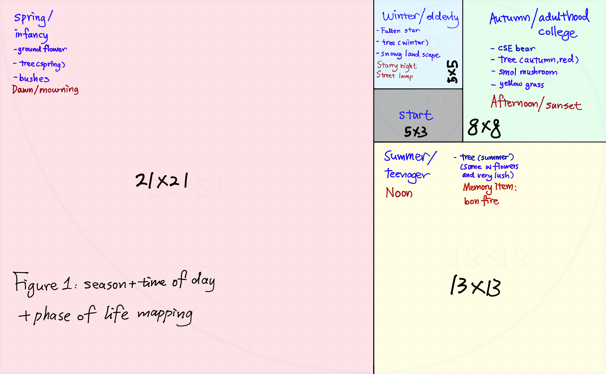
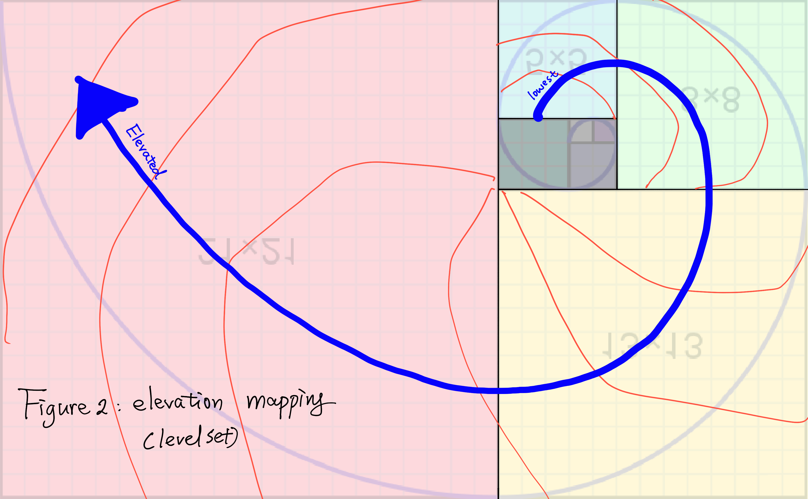
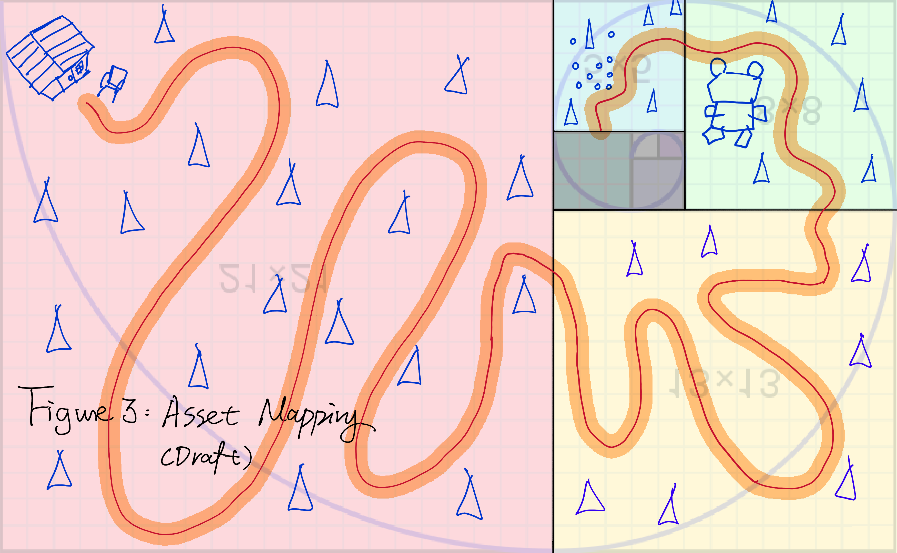
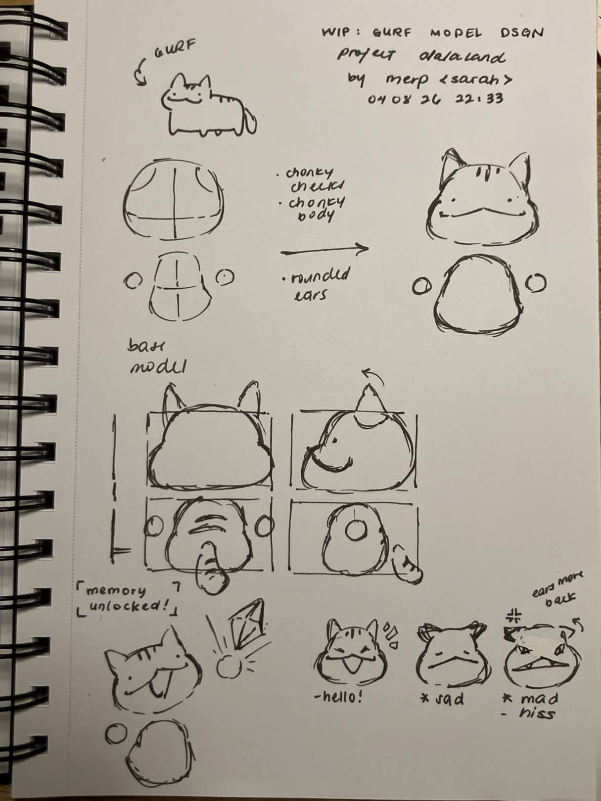
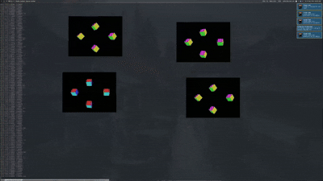

<!-- # [Weekly individual report template](https://docs.google.com/document/d/119IUXJaZzLB1Wnq-WjzROSS_ZlbwY8B1QAaQj5ue13c/edit?tab=t.1udl1fbsowz) -->
---

## Individual Reports

- [Shengrui_Chen_Individual_Report]({{ '/project-spec/shengrui-chen-individual-report/' | relative_url }})
- [Ziyue_Liu_Individual_Report]({{ '/project-spec/ziyue-liu-individual-report/' | relative_url }})
- [Jiaying_Chen_Individual_Report]({{ '/project-spec/jiaying-chen-individual-report/' | relative_url }})
- [Phillip_Mai_Individual_Report]({{ '/project-spec/phillip-mai-individual-report/' | relative_url }})
- [Sarah_Balatbat_Individual_Report]({{ '/project-spec/sarah-balatbat-individual-report/' | relative_url }})
- [Jacob_Root_Individual_Report]({{ '/project-spec/jacob-root-individual-report/' | relative_url }})
- [Alain_Zhang_Individual_Report]({{ '/project-spec/alain-zhang-individual-report/' | relative_url }})

Individual report Template:

```

## Week [Number]
1. What were your concrete goals for the week?
2. What goals were you able to accomplish?
3. If the week went differently than you had planned, what were the reasons? 
4. What are your specific goals for the next week?
5. What did you learn this week, if anything (and did you expect to learn it)?
6. What is your individual morale (which might be different from the overall group morale)?
```

**IMPORTANT**!
When importing images, make sure to put the images in the respective folder. For example, files for Sarah, Week 2 goes in `docs/assets/week2/sarah`. To link the images, use the following format:

```html

```

For example:

```html

```

Even if normal markdown format might work on your machine, it will NOT work on the actual website.

**Troubleshooting**  
Reference [README.MD]({{https://github.com/ucsd-cse125-sp26/group5}}).

---
## Week 7 Group Report

## Modeling
**Rebecca**
- Worked with Jacob to resolve two issues:
  - Scatter logic: decided duplicate meshes are acceptable without grouping.
  - Toon shading, landscape baking, and lighting.
- Finished all 4 skyboxes and gave to jacob to use. 
- Coming week: finish up the full landscape, wrap up asset work, and collaborate more closely with the game logic team for full game integration.

<div style="display: grid; grid-template-columns: 1fr 1fr; gap: 10px;">

  
  
  
  
 
</div>


**Sarah**
- Attempting to model Gurf, but no progress yet due to CSE 123 workload.
- Board model still needs to be completed.

## Rendering
**Jacob**
- Baked the food assets; also fixed baking for the cookie.
- Variety of rendering changes completed and in progress:
  - Not yet started: normal maps, texture toon shading.
  - In progress: animation and player model integration (potentially with head movement). Toon shading deferred.
- Implemented code to shift the time of day and light source based on the player's position on the map.

## Network
**Tim**
- Before the meeting: finished and merged all major outstanding PRs.
- Currently working on the screen overlay system; PR not yet opened but targeting this Wednesday and Thursday.

## Game Logic: Minigames / Puzzles
**Leon**
- All 4 players can now control the maze and complete it; upon completion the maze exits correctly.
- Fragment entity renders as a cube placeholder for now.
- Maze trigger region PR is in — players can activate it.
- Next step: integrate fragments into the maze. Needs a blocker for the next region to be set up (likely Philip's task).

**Philip**
- Started fragment logic: when a fragment spawns, one of the 4 players must pick it up, completing that section and triggering color restoration.
- Linking fragment completion to maze completion is the remaining piece; after that the barrier work passes to Alain.

## Physics / Audio
**Alain**
- Sound system finished; needs refactoring and cleanup to make loading `.np4` files easier. Still needs to source actual audio assets.
- Barrier system implemented: a server-side entity that can be toggled on and off via debug mode. Just needs placement coordinates. Will coordinate with Philip this week.
- Will also work with Rebecca to get the fence models in place as visual barriers.

---

## Week 6 Group Report

## Network: Minigame

**Tim**

- Mainly working on the mini games pipeline.
  - Finished the 2D overlay pipeline; everything is rendering correctly. Cleaning up code now.
  - Engine-side work: the 2D **pipeline** is straightforward to work with. Objects are placed by specifying a coordinate server-side, which maps directly to the overlay position.
  - Rendering: Set up a separate render and framebuffer for the maze, and successfully rendered a maze onto the map.

## Game Logic: Minigames

**Leon & Philip**

- Worked on a 2D version of the maze minigame; plan to combine with Tim's 2D pipeline after his branch is pushed, followed by a refactor.
- **Philip**: Implementing recoloring logic, since only completed parts of the map sections show color. Writing logic to determine when each section should be colored in. Core flow: collect fragment → set section complete → create bounding box for that section.

<div style="display: grid; grid-template-columns: 1fr 1fr; gap: 10px;">
  
  
</div>

## Physics / Audio

**Alain**

- Reviewed Jacob's PR for the new rendering changes.
- Continuing work on sound: exploring an open-source audio mod and thinking through how to transmit sound events so the client knows when to play them and sounds follow their source correctly.

## Rendering

**Jacob**

- Cleaned up and merged two major PRs: map loading and the final-ish render pipeline.
- Working on animation and planning out how to implement color correctly.
- Investigating a lighting artifact caused by something wrong with the sun; also working on some GUI elements.
- Looking into a Blender-side mesh deduplication workflow: linking objects via pointer tags, creating a mesh per tag, and merging identical meshes to reduce redundancy. External tools may help; will check if this becomes a problem in the next PR.

Thank you Humam Saknini for your free image hosting

<div style="display: grid; grid-template-columns: 1fr 1fr; gap: 10px;">
  
  
</div>

## Modeling

**Sarah**

- Character model: Dog model in progress.
  - Working through how to model the fluffy sections; studying references and trying to match the shading style.
  - Model rigging complete.

<div style="display: grid; grid-template-columns: 1fr 1fr; gap: 10px;">
  
  
</div>


**Rebecca**

- Landscape model: created many more assets and have started merging them onto the main landscape model. Have already worked with Rendering team to get assets to the main world map!
  - Fixed landscape low poly display issue by applying tsxture nodes. Discussion with jacob to bake changes so it displays in game.
  - Scattered assets; Having issue with default scatter not looking good, so I did it semi mannually. Discussing with Jacob about optimizing.

<div style="display: grid; grid-template-columns: 1fr 1fr; gap: 10px;">
  
  
  
  
  
  
  
  
  
  
</div>

---

## Week 5 Group report

## Network and graphics

**Tim**

- Spoke with Jacob and reached consensus on minigame architecture: the engine needs to support spawning a new game and creating a 2D minigame within the main game.
- Some games will be more intuitive as 2D and will run on the surface of the main map; others can spawn a separate 3D world. This flexibility means if time runs short, the 2D game can stand alone.
- End-to-end functionality is the prioritylandscape must be in place. Don't stress over specific details.
- Suggested looking into the map loading branch to explore whether an end-to-end game is feasible from it.

## Rendering

**Jacob**

- Rendering changes in progress; map uploading is on a side branch.
- Focused on exam this week.
- Next step: Thursday 9am sync to figure out individual report for approximation.

## Modeling

**Rebecca**

- Worked on the landscape; coloring is done, also worked on some assets.


**Sarah**

- No progress this week due to CSE 123 midterm and PA crunch.
- Plan after midterms: work on the skeleton for the base model and potentially redo the mouse design.


## Game logic: Minigames / Puzzles

**Philip**

- Met with Leon during Friday's tech team meeting to discuss puzzle implementation details, determined whether each puzzle will be 2D or a separate 3D game.
- Needs to review and merge a PR from Tim into his branch (checking with Leon on whether it's already been done).
- Will regroup with Leon this week to sort out next steps.

**Leon**

- Implemented basic functions for cubes.
- Next step: test whether the functions work correctly when the game window is opened (e.g. verifying cube behaviour at runtime).

## Physics

**Alain**

- Cleaning up code and working on getting hitboxes functional for Jacob's debugging (hitbox rendering).
- Jacob flagged that hitbox rendering may no longer be needed. Many things now default to mesh hitboxes via a PR. Needs to check the relevant PR assignment.
- Next focus: sound.

---

## Week 4 Group report

## Admin

**Rebecca & Jacob**
Met for Rebecca to come up with a hollistic view of the project repo for better understanding of running tasks & whole project's development.
<div style="display: grid; grid-template-columns: 1fr 1fr 1fr; gap: 10px;">
  
  
  
</div>

## Modeling

**Rebecca**

- Landscape: Basic landscape modeling completely patched up, connected and finished. Next step is to optimize dirty mesh so its easier for the rendering people.

<div style="display: grid; grid-template-columns: 1fr 1fr; gap: 10px;">
  
  
  
  
</div>


- Assets:
  - Fallen star basic model done. Texture etc will come later.


<div style="display: grid; grid-template-columns: 1fr 1fr; gap: 10px;">
  
  
  
</div>
  - Experimenting with trees; Failing but we will get there...hopefully

<div style="display: grid; grid-template-columns: 1fr 1fr 1fr 1fr 1fr; gap: 10px;">
  
  
  
  
  
</div>

**Sarah**
Came up with detailed design and color for character Gurf


### Map / World Building

**Jacob**

- Issue: file format exported from Blender does not give desired data format to game engine.
- Working on proper map generation pipeline to enable collaborative world building.
- Investigating a file conversion workflow to map Blender objects to in-game objects, since Blender's export format does not match the required file size constraints.
- Goal is to split a single Blender model into separate meshes and create a clear mapping from Blender assets to game map entities, making it easy to place objects (e.g., trees on hills) in the correct positions.


## Game State & Minigames

**Tim**

- Created the game state system; resolved a version mismatch that required reorganizing the file structure.
- Standardized the minigame framework to make it easier for others to contribute and for the game logic team to implement individual minigames.
- PR will be submitted after Philip's branch is merged.
- Wants to see a real map as soon as possible.

**Philip & Leon**

- Implemented additional components for the game state controller, including door, puzzle, and timer logic.
- Added a function to load entities on game start, separated from main.
- Potential conflicts with Tim's work identified — will coordinate with Tim this week to resolve.

## Physics

**Alain**

- Refactoring server-side game code: decoupling physics logic into its own dedicated physics engine class.
- Phyics tick have been patched to sync with the game and server tick.

---

## Week 3 Group report

The team continued development across graphics, networking, physics, and puzzle systems.

## Modeling

**Rebecca**

- Came up with detailed light and environment study for the game.
- Continuing to deepen understanding of blender application, started basic modeling.
<!-- 


 -->
<div style="display: grid; grid-template-columns: 1fr 1fr; gap: 10px;">
  
  
  
  
</div>
<div style="display: grid; grid-template-columns: 1fr 1fr; gap: 10px;">


</div>


**Sarah**

- Came up with detailed design for character.


<div style="display: grid; grid-template-columns: 1fr 1fr; gap: 10px;">
  
  
  
  
  
  
</div>

## Technical

**Alain**

- Hooked up floor to body (100×100 grid)
- Focused on collision detection
- Working on debug mode for wireframing

**Tim**

- Implemented 2 straps using 2 registries
- Identified small latency issue; investigating root cause
- Issues observed with velocity, working to improve smoothness and reduce stuttering
- Registry is currently single-threaded (used for client-side rendering); moving to multi-threaded introduces shared resource contention
- Experimenting with tick rate adjustments; needs end-to-end testing to isolate the source of jumping between two clients
- Investigating tick rate, registry locking, and render code complexity
- May collaborate with Jacob if render code proves too complex

**Jacob**

- Set up GitHub Actions CI
- Cleaned up graphics code
- Revamped input handling for easier extensibility
- Completed: Skybox
- In progress / upcoming: shadows, debug console


**Phil**

- Read about packets and ECS
- Implemented a packet system for puzzle state
- Exploring use of ECS for puzzle state instead of additional packages
- Packet system is convertible into ECS

**Leon**

- Collaborating with graphics team to create puzzle
- Currently using package-based approach

---

## Week 2 Group report

Based on established idea of game mechanics, the team dug further into solidifying our game's story and structure. We came up with a better project spec.


### Admin

Updated game name, mechanics, solidified story and background.

### Modeling

**Rebecca**  

- For landscape: Gathered assets and planned textures, drafted 3D map layout
- Updated project spec to be more concrete and clear
- Kept team aligned via Discord announcements and weekly check-ins


<!-- 

 -->

**Sarah**

- Contributed to finishing puzzle design
- For character model: Completed a tutorial more advanced than current game scope to build skill
  - base model sketch
  - gurf sketch

<!--  -->

### Technical

**Jacob**

- Got a cube rendering — model rendering pipeline underway
- Delegated tasks to two teammates with clear scope
<!-- 
 -->


**Tim**

- Pull request merged; network decoupled — client-to-server transmission working
- Infrastructure in place; needs key bindings, input callbacks, and backend tweaks
- Next: write additional callback functions (e.g. WASD movement generalized from hardcoded)  

**Alain**

- Set up Jolt physics engine in a separate branch and experimenting with it
- Working on supporting classes (!)

**Leon & Philip**

- Story: Finished main storyline with linear structure
- Helped settle type of puzzles centered around 4 phases of life, scaling from easy to hard

---

## Week 1 Group report

### What we did

The team brainstormed core mechanics and narrowed down to three game concepts, with a focus on keeping scope manageable given the 10-week timeline + Initial project setup on github.


**Code & Repo setup**

- Repo/build/tooling scaffolded: cross-platform build scripts (build.sh, build-windows.sh, build-linux-gcc.sh), CMake project (CMakeLists.txt), and clangd support via compile_commands.json + build_lsp.sh.
- Dependencies + dev environment established: external libs are tracked under lib/ (GLFW, GLAD, ENet, EnTT, Dear ImGui), with a Nix devshell available (flake.nix, flake.lock).
- Project planning foundations drafted: initial project spec + team roles/process documented (spec.md, plus links to the main doc/brainstorm board in README.MD).

**General Design Principles Agreed On**

- Timed, co-op game for a team of 4
- Single map (no stages) to keep development feasible
- Score-based replayability; day/night modes for difficulty variation
- Key inspirations: Overcooked, Among Us, Keep Talking and Nobody Explodes

**Idea 1 — Item Scramble (Arcade Style):** Players collect randomly spawning items across a city map within a time limit. Features speed boosts, upgrades, and enemy entities. No win/lose condition — just beat your high score. Pros: easy to develop, infinitely replayable. Cons: may get boring without stakes.

**Idea 2 — Road Run (Sectioned Map):** Players progress through a linear map with distinct rooms, collecting loot and collaborating to unlock doors via communication puzzles. Has a clear win/lose condition tied to the timer, making stakes feel real. Emphasis on player communication as the core fun factor.

**Idea 3 — Memory Realm (Narrative Co-op):** The most story-driven pitch. A gray, forgotten world restored across 3 maps (Courtyard → Town Street → Memory Summit). Each player has a unique ability, requiring asymmetric communication and synchronization. Restoring areas visually transforms them. Richest concept but likely the highest scope.

## Plan for next week

The team has voted on the general framework of the game. For the following week, our plan is to:

- Solidify the format of the game by combining everyone's ideas.
- Modeling team: Start creating concept art
- Physnet: Work on the established simple, barebone client-server model.

- **What went well**
N/A
- **What blocked us**
N/A
