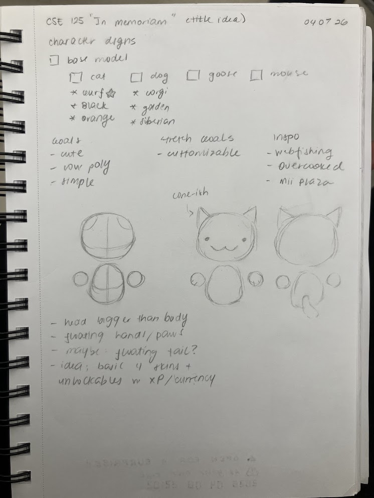
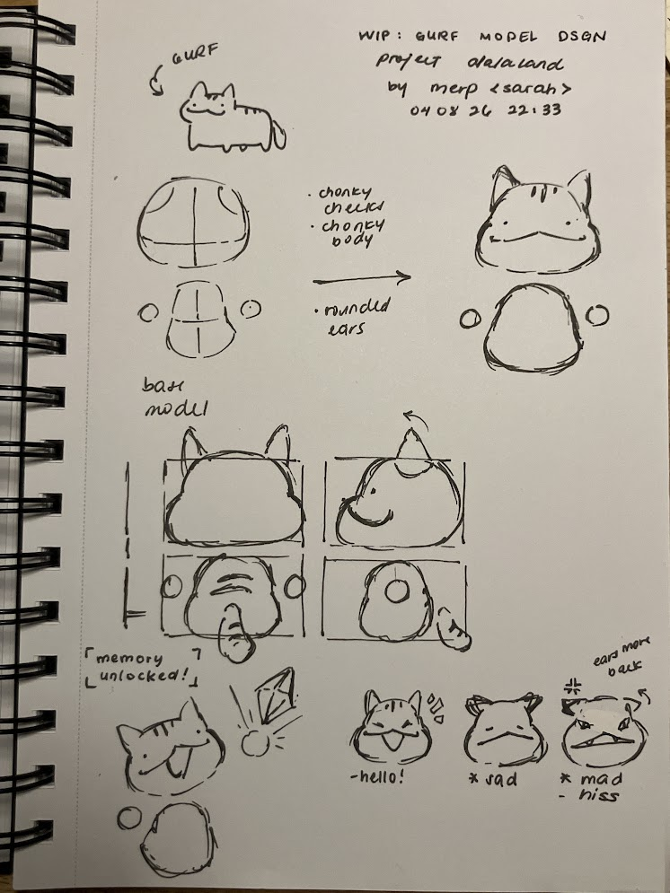
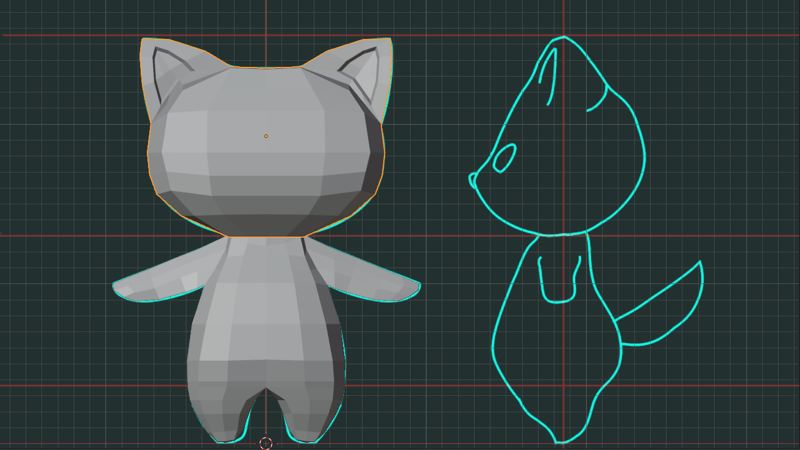
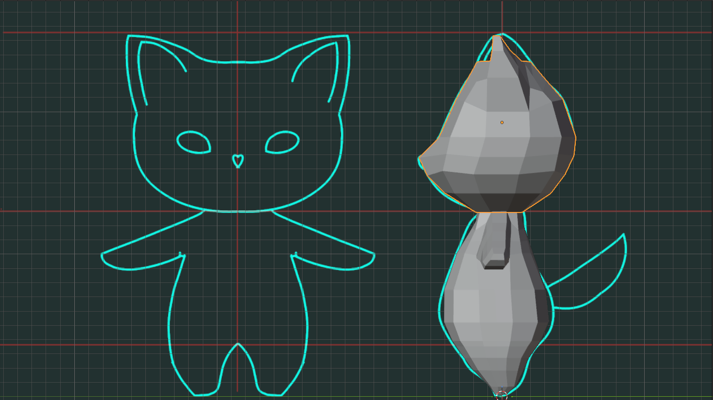

# [SARAH] Weekly individual status report 

## Week [Number]
1. What were your concrete goals for the week?
2. What goals were you able to accomplish?
3. If the week went differently than you had planned, what were the reasons? 
4. What are your specific goals for the next week?
5. What did you learn this week, if anything (and did you expect to learn it)?
6. What is your individual morale (which might be different from the overall group morale)?

## Week 2
### Goals
- [x] Solidify game design details
- [x] Start creating concept art
- [x] Start learning modeling on Blender

### Achieved
- Assigned design roles
  - Rebecca took up landscape / map design
  - My role is on character models
- Game design details
  - Brainstormed playable character designs
    - MVP: Gurf (cat), Corgi (dog), Goose, Mouse
    - Would-Be-Nice: cat variants (black, orange), dog variants (Siberian, golden retriever)
  - Brainstormed puzzle mini games for unlocking memory fragments
    - Memory: Players are all given a randomly generated pattern of cards for some set amount of time. The cards will have a color, shape, and number on every card. The players have to recreate the pattern they were given. They are scored based on accuracy and must meet a threshold to proceed. Otherwise, they'll retry with another pattern of cards.
    - Decryption: The team is given an encrypted phrase. They must decrypt it under some set of constraints.
      - Set A: Provide the key of a monoalphabetic substitution cipher i.e., a set of symbols for all English letters A-Z. The players can use this key to decrypt the encrypted phrase.
      - Set B: Provide a subset of the monoalphabetic substitution cipher such that there are less symbols to look at but still contains all the letters needed for decryption and some unnecessary ones.
      - Set C: Indicate that the phrase is encrypted under Caesar cipher but provide no key (involves codebreaking, likely very difficult without prior knowledge). The Caesar cipher functions such that the encrypted letters is shifted some amount from the original. For example, under an E-shift Caesar cipher, the letter A maps to E, and all the other letters maintain the expected order (B -> F, C -> G, D -> H, etc.)
      - Set D: Provide one letter as the key without disclosing it's a Caesar cipher (also involves codebreaking, likely even more difficult than Set C)
- Concept art
  - Sketched base model: Disjointed head, body, and spherical hands. Markers for ears. Roughly inspired by Webfishing, Overcooked, and Mii Plaza player models.
  
  - Sketched Gurf model: Same disjointed pieces as base model, but some different proportions to emphasize Gurf's chubbiness. There are also ideas of emotes as a Would-Be-Nice feature.
  
- Modeling progress
  - Followed a [Blender tutorial](https://youtu.be/FwkPW5LEGs8) for creating a low-polygon cat.
   

### Progress Evaluation

The progress went slower than I originally hoped, mainly because of other responsibilities and partially because of "Senioritis". Upon looking at what I've gotten done though, it's actually not that bad.

### Upcoming Goals

- Continue tutorial for rigging lesson
- Start modeling base model
- Create concept art for other MVPs
  - Goose
  - Corgi
  - Mouse
- Create decryption puzzle symbols

### Lessons Learned

- I'm getting the hang of modeling on Blender. It's not too bad once I'm in a groove, and the computer I'm working on doesn't have latency issues.
- There is a lot of compromise that comes with designing a game with a full team. I had an idea this would be the case, but it didn't hit until we started realizing we have varying ideas of what we wanted the game to look like, how we want the gameplay to proceed, etc.

### Individual Morale

I'm mainly motivated by getting to play a character I designed in a story I helped build. The gameplay has changed drastically over the first two weeks of designing. I'm not dissatisfied with the themes we came up with since I'm a big fan of themes revolving around memories, but there's parts of the gameplay (such as collecting) that I wish we got to keep more of. We still have the collecting aspect but it's not really to the degree I originally envisioned. I do like how the puzzles are shaping up, as well as the story.

I'm somewhat excited to see what we'll end up with. I prefer to err towards less and simpler things to implement because I worry we'll go too far out of scope, but the tech team having things running and the fun we might be able to have gives me some hope.

## Week 1
### What we did

Brainstormed core mechanics with the team and narrowed down to three game concepts. Maintained focus on keeping scope manageable given the 10-week timeline. Initial project setup on github. 

**Code & Repo setup** 
- Helped draft project spec: set up document outline based on project spec questions.

**General Design Principles Agreed On**
- Timed, co-op game for a team of 4
- Single map (no stages) to keep development feasible
- Score-based replayability; day/night modes for difficulty variation
- Key inspirations: Overcooked, Among Us, Keep Talking and Nobody Explodes

**Idea 1 — Item Scramble (Arcade Style):** Players collect randomly spawning items across a city map within a time limit. Features speed boosts, upgrades, and enemy entities. No win/lose condition — just beat your high score. Pros: easy to develop, infinitely replayable. Cons: may get boring without stakes.

**Idea 2 — Road Run (Sectioned Map):** Players progress through a linear map with distinct rooms, collecting loot and collaborating to unlock doors via communication puzzles. Has a clear win/lose condition tied to the timer, making stakes feel real. Emphasis on player communication as the core fun factor.

**Idea 3 — Memory Realm (Narrative Co-op):** The most story-driven pitch. A gray, forgotten world restored across 3 maps (Courtyard → Town Street → Memory Summit). Each player has a unique ability, requiring asymmetric communication and synchronization. Restoring areas visually transforms them. Richest concept but likely the highest scope.

## Plan for next week
- Solidify game design details
- Start creating concept art
- Start learning modeling on Blender

- **What went well**
  - Lots of ideas for brainstorming
- **What blocked us**
  - Consensus voting

